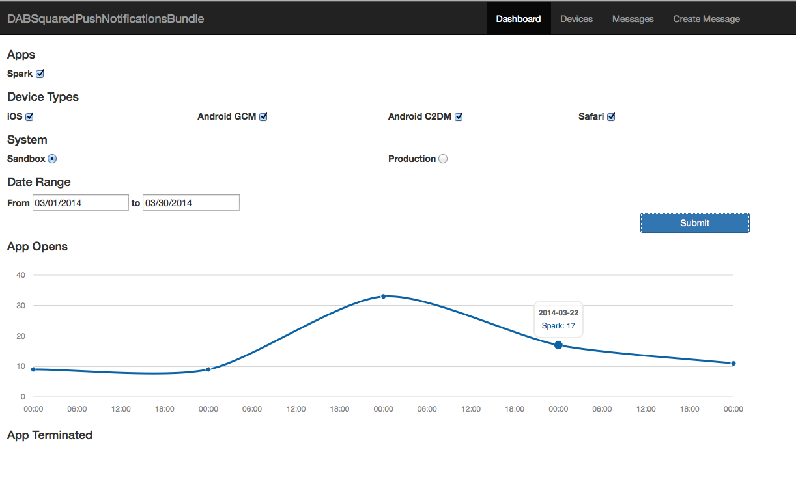
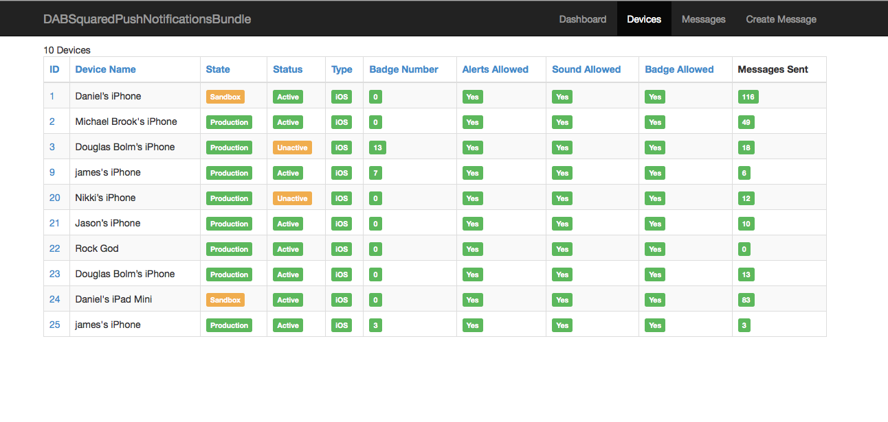
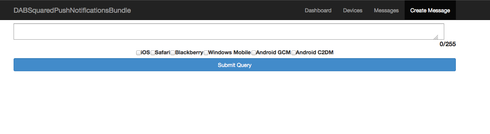

# DABSquaredPushNotificationsBundle 


A bundle to allow sending of push notifications to mobile devices.  Currently supports Android (C2DM, GCM), Blackberry, Safari and iOS devices. The Base framework is imported from https://github.com/richsage/RMSPushNotificationsBundle

Any contributions are welcome. The goal here is to provide an interface for push notifications with device registration and user device pairing just like FOSCommentBundle, but with very little code to write.

[](http://knpbundles.com/DABSquared/DABSquaredPushNotificationsBundle)


Road Map
-------------

See Issue #7


Documentation
-------------

The bulk of the documentation is stored in the `Resources/doc/index.md`
file in this bundle:

[Read the Documentation](https://github.com/DABSquared/DABSquaredPushNotificationsBundle/blob/master/Resources/doc/index.md)

Installation
------------

All the installation instructions are located in [documentation](https://github.com/DABSquared/DABSquaredPushNotificationsBundle/blob/master/Resources/doc/index.md).

License
-------

This bundle is under the MIT license. See the complete license in the bundle:

    Resources/meta/LICENSE

## Admin Web Interface





## Sending Messages

Send to a User:

``` php
use DABSquared\PushNotificationsBundle\Message\iOSMessage;

class PushDemoController extends Controller
{
    public function pushAction($aUser)
    {

        foreach($aUser->getDevices() as $device) {

            $message = new Message();
            $message->setMessage('Oh my! A push notification!');
            $message->setDevice($device);
            $this->container->get('dab_push_notifications')->send($message);

        }

        return new Response('Push notification send!');
    }
}
```

Send to a Device:

``` php
use DABSquared\PushNotificationsBundle\Message\iOSMessage;

class PushDemoController extends Controller
{
    public function pushAction($aDevice)
    {
        $message = new Message();
        $message->setMessage('Oh my! A push notification!');
        $message->setDevice($aDevice);

        $this->container->get('dab_push_notifications')->send($message);

        return new Response('Push notification send!');
    }
}
```


[](https://bitdeli.com/free "Bitdeli Badge")

